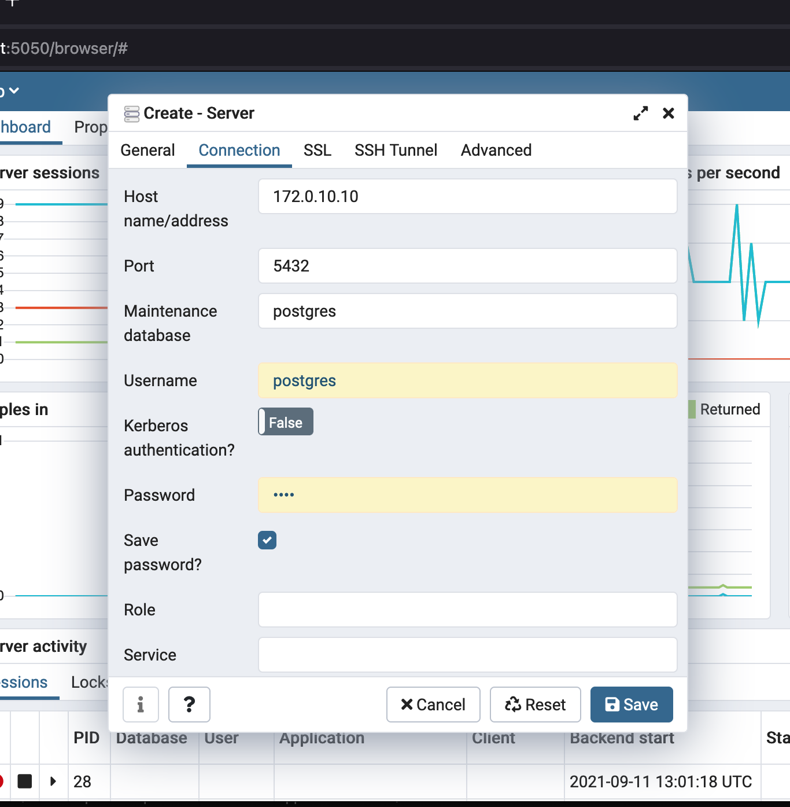

# fizzy-disco

SQL Class

## Setup

```bash
git clone git@github.com:nickagee/fizzy-disco.git
cd fizzy-disco
docker-compose up -d
```

Open a web browser and navigate to [http://localhost:5050/browser/](http://localhost:5050/browser) to open pgAdmin.

Login in with these credentials that were set in the `docker-compose.yml` file: 

```dockerfile
...
PGADMIN_DEFAULT_EMAIL: admin@admin.com
PGADMIN_DEFAULT_PASSWORD: root
...
```

Next create a new connection to the server by using the default user `postgres` and the password that was set in the `docker-compose.yml` file

```dockerfile
...
environment: 
      POSTGRES_PASSWORD: root
...
networks: 
      class_net:
        ipv4_address: 172.0.10.10
...
```

The connection information should look similar to the image below.


